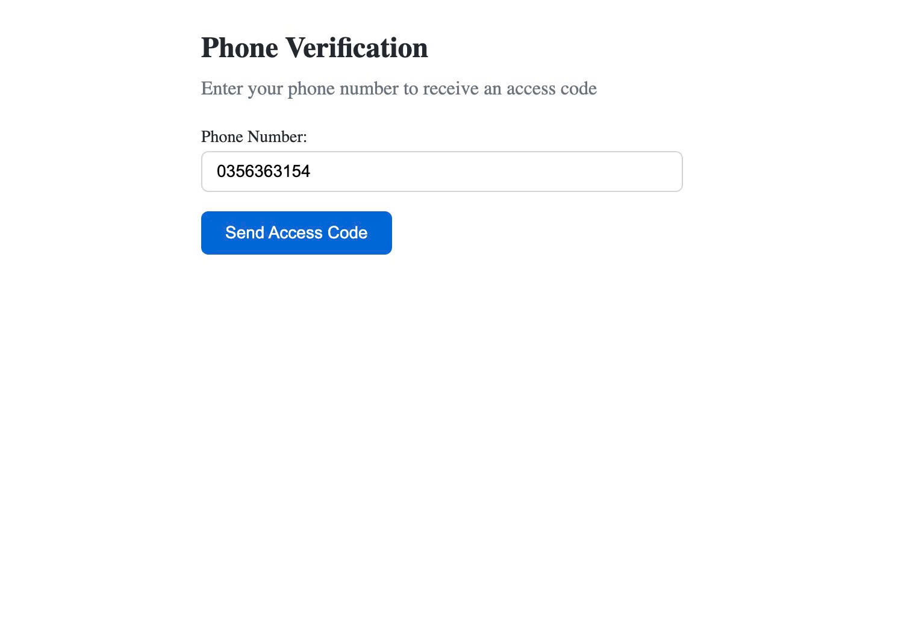
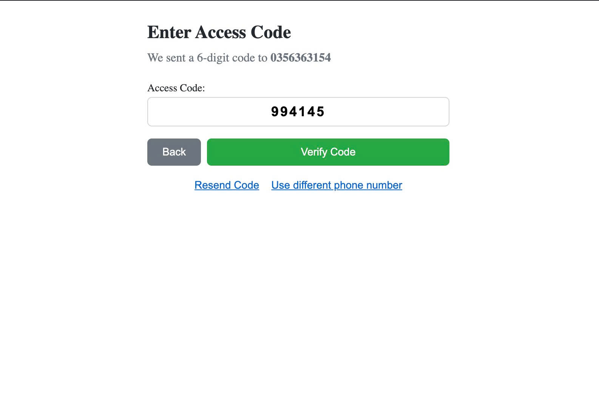
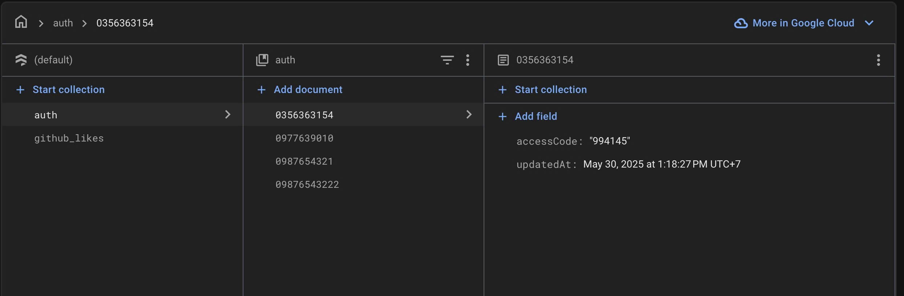
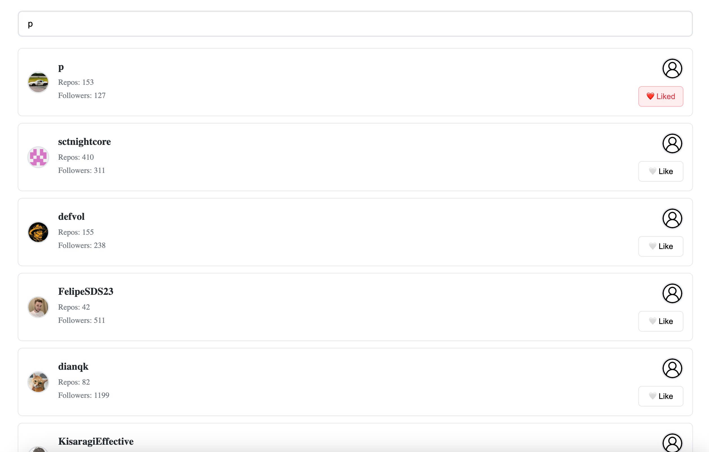

# Skipli Auth App

## Overview

Skipli Auth App is a modern React application built with TypeScript that provides authentication functionality with GitHub integration. The application uses React 19, Redux Toolkit for state management, React Query for data fetching, and React Router for navigation.

## Features

- GitHub authentication
- User management
- GitHub user search functionality
- Pagination controls
- Modern React practices with hooks
- Type-safe development with TypeScript

## Tech Stack

- **React 19**: Frontend library
- **TypeScript**: Static type checking
- **Redux Toolkit**: State management
- **React Query**: Data fetching and caching
- **React Router DOM**: Navigation
- **Axios**: HTTP client
- **React Hot Toast**: Toast notifications

## Project Structure

```
skipli-auth-app/
├── public/
├── src/
│   ├── components/       # Reusable UI components
│   ├── configs/          # Configuration files
│   ├── contexts/         # React contexts
│   ├── hooks/            # Custom React hooks
│   ├── pages/            # Page components
│   │   └── auth/         # Authentication pages
│   ├── github/           # GitHub integration
│   │   ├── components/   # GitHub-specific components
│   │   ├── hooks/        # GitHub-specific hooks
│   │   ├── styles/       # GitHub-specific styles
│   │   └── types/        # GitHub-specific types
│   ├── routers/          # Routing configuration
│   ├── services/         # API services
│   ├── styles/           # Global styles
│   ├── utils/            # Utility functions
│   ├── App.tsx           # Main App component
│   └── index.tsx         # Entry point
├── .env                  # Environment variables
├── .gitignore            # Git ignore file
├── config-overrides.js   # Custom webpack configuration
├── package.json          # Dependencies and scripts
└── tsconfig.json         # TypeScript configuration
```

## Start application

```bash
npm dev
yarn dev
```
## Prerequisites

- Node.js (v20 hoặc cao hơn)
- npm hoặc yarn

## Installation

1. Clone repository:
   ```bash
   git clone https://github.com/phuocbeyou/skipli-frontend-test
   cd skipli-auth-app

## 📸 Screenshots

### Enter number phone


### Firebase OTP


### Verify OTP


### Search github
